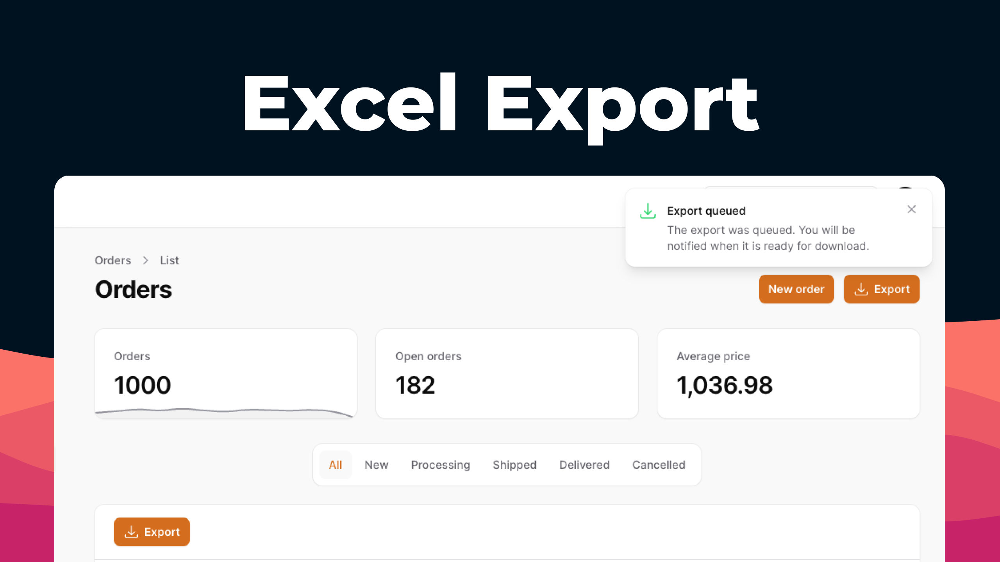

<div class="filament-hidden">



</div>

# Filament Excel

<div class="filament-hidden">

[](https://packagist.org/packages/pxlrbt/filament-excel)
[](LICENSE.md)

[](https://packagist.org/packages/pxlrbt/filament-excel)

</div>

Easily configure your Excel exports in Filament via a bulk or page action.

<div class="filament-hidden">

[Demo Video](https://user-images.githubusercontent.com/22632550/174591523-831df501-76d5-456a-b12e-f6d8316fb673.mp4  ':include :type=video controls width=100%')

</div>


## Installation

Install via Composer. This will download the package and [Laravel Excel](https://laravel-excel.com/).

| Plugin Version | Filament Version | PHP Version |
|----------------|------------------|-------------|
| 1.x            | 2.x              | \> 8.0      |
| 2.x            | 3.x              | \> 8.1      |
| 3.x            | 4.x              | \> 8.1      |

```bash
composer require pxlrbt/filament-excel
```

### Upgrading to Filament v4

- `composer require pxlrbt/filament-excel:3.0`
- The Action classes were simplified into a single `ExportBulkAction` and `ExportAction` for pages and tables

### Laravel > 9

If composer require fails on Laravel 9 or greater because of the simple-cache dependency, you will have to specify the psr/simple-cache version as ^2.0 in your composer.json to satisfy the PhpSpreadsheet dependency. You can install both at the same time as:

```bash
composer require psr/simple-cache:^2.0 pxlrbt/filament-excel
```

## Quickstart

Starting with v0.2 Filament Excel should work with both `filament/filament` and `filament/tables` packages. The most simple usage is just adding `ExportBulkAction` to your bulk actions.

**Example for admin package**

```php
<?php

namespace App\Filament\Resources;

use pxlrbt\FilamentExcel\Actions\Tables\ExportBulkAction;

class UserResource extends Resource
{  
    public static function table(Table $table): Table
    {
        return $table
            ->columns([
                //   
            ])
            ->bulkActions([
                ExportBulkAction::make()
            ]);
    }
}
```

**Example for _separate_ table package**

```php
<?php

namespace App\Filament\Resources;

use pxlrbt\FilamentExcel\Actions\Tables\ExportBulkAction;

public function getTableBulkActions()
{
    return  [
        ExportBulkAction::make()
    ];
}
```


## Usage

Filament Excel comes with three actions you can use:
- `Actions\Tables\ExportBulkAction` for table bulk actions
- `Actions\Tables\ExportAction` for table header actions
- `Actions\Pages\ExportAction` for record pages

Without further configuration they will try to resolve the fields from the table or form definition and output an Excel file.

### Multiple export classes

You can overwrite the default export class and also configure multiple exports with different settings. The user will be shown a modal to select the export class he wants to use.

```php
use pxlrbt\FilamentExcel\Actions\Tables\ExportAction;
use pxlrbt\FilamentExcel\Exports\ExcelExport;

ExportAction::make()->exports([
    ExcelExport::make('table')->fromTable(),
    ExcelExport::make('form')->fromForm(),
])
```

### Closure customization

Many of the functions for customising the export class, accept a Closure that gets passed dynamic data:

```php
use pxlrbt\FilamentExcel\Actions\Tables\ExportAction;
use pxlrbt\FilamentExcel\Exports\ExcelExport;

ExportAction::make()->exports([
    ExcelExport::make('table')->withFilename(fn ($resource) => $resource::getLabel()),
])
```

The following arguments are available:
- `$livewire`: Livewire component (not available for queued exports)
- `$livewireClass`: Livewire component class
- `$resource`: Resource class
- `$model`: Model class
- `$recordIds`: IDs of selected records (Bulk Action)
- `$query`: The builder instance 

### Filename

The filename is set via `->withFilename()`:

```php
use pxlrbt\FilamentExcel\Actions\Tables\ExportAction;
use pxlrbt\FilamentExcel\Exports\ExcelExport;

ExportAction::make()->exports([
    // Pass a string
    ExcelExport::make()->withFilename(date('Y-m-d') . ' - export'),
    
    // Or pass a Closure
    ExcelExport::make()->withFilename(fn ($resource) => $resource::getLabel())
])
```

### Export types

You can set the file type via `->withWriterType()`:

```php
use pxlrbt\FilamentExcel\Actions\Tables\ExportAction;
use pxlrbt\FilamentExcel\Exports\ExcelExport;

ExportAction::make()->exports([
    ExcelExport::make()->withWriterType(\Maatwebsite\Excel\Excel::XLSX),
])
```


### Defining columns

When using `->fromForm()`/`->fromTable()`/`->fromModel()` the columns are resolved from your table or form definition. You can also provide columns manually, append columns or overwrite generated columns.

```php
use pxlrbt\FilamentExcel\Actions\Tables\ExportAction;
use pxlrbt\FilamentExcel\Exports\ExcelExport;
use pxlrbt\FilamentExcel\Columns\Column;

ExportAction::make()->exports([
    ExcelExport::make()->withColumns([
        Column::make('name'),
        Column::make('created_at'),
        Column::make('deleted_at'),
    ]),
])
```

You can also include only a subset of columns (`->only()`) or exclude certain ones (`->except()`):

```php
use pxlrbt\FilamentExcel\Actions\Tables\ExportAction;
use pxlrbt\FilamentExcel\Exports\ExcelExport;

ExportAction::make()->exports([
    ExcelExport::make()->fromTable()->except([
        'created_at', 'updated_at', 'deleted_at',
    ]),
    
    ExcelExport::make()->fromTable()->only([
        'id', 'name', 'title',
    ]),
])
```

When you neither pass `->only()` nor `->except()` the export will also respect the `$hidden` attributes of your model, for example the `password` on the user model. You can disable this by passing an empty array `->except([])`.

### Headings

When using `->fromForm()`/`->fromTable()`/`->fromModel()` the headings are resolved from your table or form definition. You can also overwrite headings:

```php
use pxlrbt\FilamentExcel\Actions\Tables\ExportAction;
use pxlrbt\FilamentExcel\Exports\ExcelExport;
use pxlrbt\FilamentExcel\Columns\Column;

ExportAction::make()->exports([
    ExcelExport::make()->withColumns([
        Column::make('name')->heading('User name'),
        Column::make('email')->heading('Email address'),
        Column::make('created_at')->heading('Creation date'),
    ]),
])
```

If you want to use the column names and don't like the headings auto generated you can use `->withNamesAsHeadings()`. To disable headings entirely you can append `->withoutHeadings()`

### Formatting

Every column can be formatted by providing a Closure. Additional to the default parameters you get access to `$state` and `$record`.

```php
use pxlrbt\FilamentExcel\Actions\Tables\ExportAction;
use pxlrbt\FilamentExcel\Exports\ExcelExport;
use pxlrbt\FilamentExcel\Columns\Column;

ExportAction::make()->exports([
    ExcelExport::make()->withColumns([
        Column::make('email')
            ->formatStateUsing(fn ($state) => str_replace('@', '[at]', $state)),
            
        Column::make('name')
            ->formatStateUsing(fn ($record) => $record->locations->pluck('name')->join(','),
    ]),
])
```

Columns are auto-scaled to fit the content. If you want to overwrite this with a custom column width you can do so:

```php
use pxlrbt\FilamentExcel\Actions\Tables\ExportAction;
use pxlrbt\FilamentExcel\Exports\ExcelExport;
use pxlrbt\FilamentExcel\Columns\Column;

ExportAction::make()->exports([
    ExcelExport::make()->withColumns([
        Column::make('email')->width(10)
    ]),
])
```
The underlying package PhpSpreadsheet provides various options for Excel column formatting. Inspect the `NumberFormat` list for the full list.


```php
use pxlrbt\FilamentExcel\Actions\Tables\ExportAction;
use pxlrbt\FilamentExcel\Exports\ExcelExport;
use pxlrbt\FilamentExcel\Columns\Column;
use PhpOffice\PhpSpreadsheet\Style\NumberFormat;

ExportAction::make()->exports([
    ExcelExport::make()->withColumns([
        Column::make('currency')->format(NumberFormat::FORMAT_CURRENCY_EUR_INTEGER)
    ]),
])
```

#### Ignore Formatting

When using `->fromForm()`/`->fromTable()` the formatting is resolved from your table or form definition. If you don't want to overwrite every columns `->formatStateUsing()` method, you can ignore the formatting altogher or for specific columns by using `->ignoreFormatting()`:

```php
use pxlrbt\FilamentExcel\Actions\Tables\ExportAction;
use pxlrbt\FilamentExcel\Exports\ExcelExport;
use pxlrbt\FilamentExcel\Columns\Column;

ExportAction::make()->exports([
    // Ignore all formatting
    ExcelExport::make()->fromTable()->ignoreFormatting()
    
    // Ignore specific columns
    ExcelExport::make()->fromTable()->ignoreFormatting([
        'created_at', 'updated_at',
    ]),
    
    // Ignore columns based on Closure
    ExcelExport::make()->fromTable()->ignoreFormatting(
        fn (Column $column) => Str::startsWith($column->getName(), 'customer_')
    ),
])
```

#### Formatters

When the state of column is not a string, it is run through a formatter even if you use `->ignoreFormatting()` to make sure it's in the right format for Excel.

Currently there are 3 formatters: `ArrayFormatter`, `EnumFormatter` and `ObjectFormatter`. You can swap out any implementation via Laravel's service container, for example to use a different delimiter for the `ArrayFormatter`:

```php
use pxlrbt\FilamentExcel\Exports\Formatters\ArrayFormatter;

class AppServiceProvider extends ServiceProvider
{
    public function register()
    {
        App::bind(ArrayFormatter::class, function () {
            return new ArrayFormatter(';');
        });
    }
```


### User input

You can let the user pick a filename and writer type by using `->askForFilename()` and `->askForWriterType()`:

```php
use pxlrbt\FilamentExcel\Actions\Tables\ExportAction;
use pxlrbt\FilamentExcel\Exports\ExcelExport;

ExportAction::make()->exports([
    ExcelExport::make()
        ->askForFilename()
        ->askForWriterType()
])
```

You can also use the users input inside a Closure:

```php
use pxlrbt\FilamentExcel\Actions\Tables\ExportAction;
use pxlrbt\FilamentExcel\Exports\ExcelExport;

ExportAction::make()->exports([
    ExcelExport::make()
        ->askForFilename()
        ->withFilename(fn ($filename) => 'prefix-' . $filename)
])
```

### Modify the query

You can modify the query that is used to retrieve the model by using `->modifyQueryUsing()`:

```php
use pxlrbt\FilamentExcel\Actions\Tables\ExportAction;
use pxlrbt\FilamentExcel\Exports\ExcelExport;

ExportAction::make()->exports([
    ExcelExport::make()
        ->fromTable()
        ->modifyQueryUsing(fn ($query) => $query->where('exportable', true))
])
```

### Queued exports

Exports for resources with many entries can take some time and therefore can be queued with `->queue()`. They will be processed in background jobs and the user will be notified with a notification on the next page load (or when Livewire is polling). 

The temporary file will be deleted after the first download. Files that are not downloaded will be deleted by a scheduled command after 24 hours.

```php
use pxlrbt\FilamentExcel\Actions\Tables\ExportAction;
use pxlrbt\FilamentExcel\Exports\ExcelExport;

ExportAction::make()->exports([
    ExcelExport::make()->queue()
])
```

The size of exported records per Job can be adjusted by using `->withChunkSize()`:

```php
use pxlrbt\FilamentExcel\Actions\Tables\ExportAction;
use pxlrbt\FilamentExcel\Exports\ExcelExport;

ExportAction::make()->exports([
    ExcelExport::make()->queue()->withChunkSize(100)
])
```


## Custom exports

If you need even more customization or want to clean up your resources by separating the export code, you can extend the ExcelExport class and configure it using `setUp()`:

```php
use pxlrbt\FilamentExcel\Actions\Tables\ExportAction;
use pxlrbt\FilamentExcel\Exports\ExcelExport;
use pxlrbt\FilamentExcel\Columns\Column;

class CustomExport extends ExcelExport
{
    
    public function setUp()
    {
        $this->withFilename('custom_export');
        $this->withColumns([
            Column::make('name'),
            Column::make('email'),
        ]);
    }
}
```

## Multiple sheets

By default, the package will only generate the sheet containing the data. However, it is possible to add additional custom sheets before and after the data sheet. 

```php
ExportBulkAction::make()->exports([
    ExcelExport::make('user_export')->fromTable()
        ->withSheets(
            sheets: [
                new OverriddenDataSheet(),
            ],
            prepend: [
                new CoverSheet(),
            ],
            append: [
                new AppendixSheet(),
            ]
        )
])
```

The array of classes that are passed to `->withSheets()` should be sheet classes as detailed [here](https://docs.laravel-excel.com/3.1/exports/multiple-sheets.html#sheet-classes)

It is also possible to pass an array of sheet classes to `->withSheets(sheets: array)` which will override the default data sheet.


## File download URL customization

By default, the package generates a signed URL with a default expiration time of 24 hours. 
The URL contains the filename including the extension. Some WAF (Web Application Firewall) solutions can block the URL due to the fact that it links to a file, which contains parameters and can cause a false positive.

```php
// Somewhere in a ServiceProvider in the `boot()` method.
use pxlrbt\FilamentExcel\FilamentExport;

FilamentExport::createExportUrlUsing(function ($export) {
    $fileInfo = pathinfo($export['filename']);
    $filenameWithoutExtension = $fileInfo['filename'];
    $extension = $fileInfo['extension'];

    return URL::temporarySignedRoute(
        'your-custom-route',
        now()->addHours(2),
        ['path' => $filenameWithoutExtension, 'extension' => $extension]
    );
});
```

## Contributing

If you want to contribute to this packages, you may want to test it in a real Filament project:

- Fork this repository to your GitHub account.
- Create a Filament app locally.
- Clone your fork in your Filament app's root directory.
- In the `/filament-excel` directory, create a branch for your fix, e.g. `fix/error-message`.

Install the packages in your app's `composer.json`:

```json
"require": {
    "pxlrbt/filament-excel": "dev-fix/error-message as main-dev",
},
"repositories": [
    {
        "type": "path",
        "url": "filament-excel"
    }
]
```

Now, run `composer update`.

## Credits
This package is based on the excellent [Laravel Nova Excel Package](https://docs.laravel-excel.com/nova/1.x/exports) by SpartnerNL and ported to [Filament](https://filamentadmin.com/).
